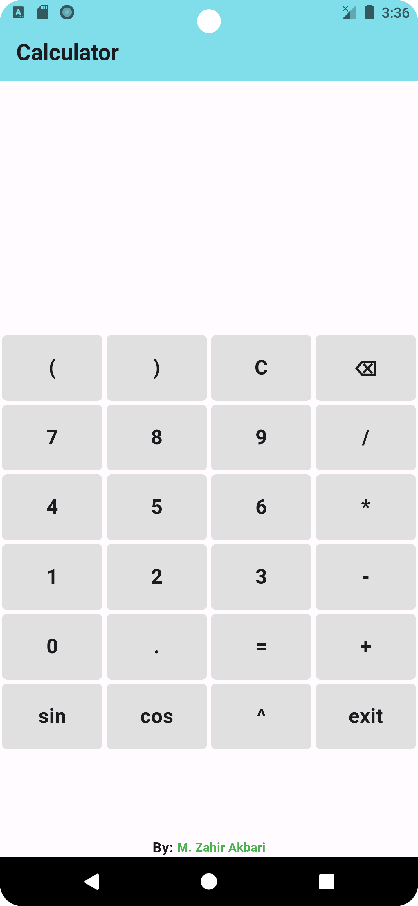

# Calculator

A calculator app built with Flutter.

## Table of Contents

- [Features](#features)
- [Installation](#installation)
- [Usage](#usage)
- [Screenshots](#screenshots)
- [Contributing](#contributing)
- [License](#license)

## Features

- **Basic Arithmetic Operations**: Addition, subtraction, multiplication, division.

- **Advanced Functions**: Trigonometric functions (sin, cos).

- **Clear and Delete**: Clear the current expression (C) and delete the last character (⌫).

- **Exit Functionality**: Exit the application (exit).

### Installation

Ensure you have Flutter installed. For detailed instructions on Flutter installation, visit Flutter.dev.

1. Clone this repository:

   ```shell
   git clone https://github.com/M-Zahir-Akbari/Calculator.git
   ```

2. Install dependencies:

   ```shell
   flutter pub get
   ```

## Usage

1. Run the app:

   ```shell
   flutter run
   ```

2. Calculator Interface:

- Enter expressions using the calculator interface
- Tap on buttons for numbers, operators, functions(`sin`, `cos`), and other controls.
- View the entered expression and the calculated result.

## Screenshots



## Contributing

Contributions are welcome! Here's how you can contribute:

1. Fork the repository.
2. Create your feature branch (`git checkout -b feature-branch`).
3. Make changes and test them.
4. Commit your changes (`git commit -am 'Add new feature'`).
5. Push to the branch (`git push origin feature-branch`).
6. Open a pull request.

## License

This project is licensed under the [MIT License](LICENSE).
